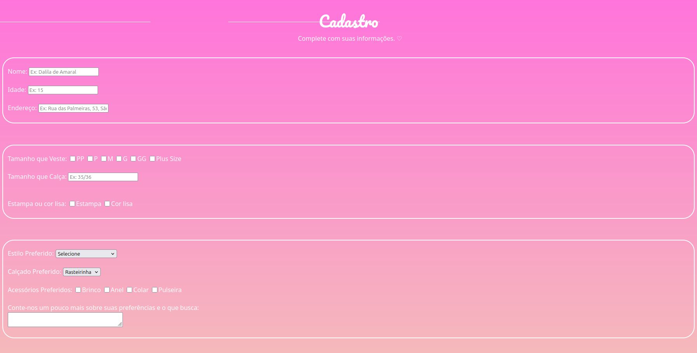

# 👗 Formulário de Cadastro de Preferências Pessoais
Este projeto apresenta um formulário interativo para coleta de informações pessoais e preferências de estilo, voltado para serviços de moda, consultoria de imagem ou e-commerce personalizado.

---
 

 

## 🎯 Objetivo
Capturar dados relevantes sobre o perfil do usuário, incluindo medidas, gostos e estilo preferido, para oferecer recomendações ou produtos personalizados.

 

## 🧩 Campos do Formulário
| Campo                     | Tipo de Entrada     | Descrição                                                |
|---------------------------|---------------------|----------------------------------------------------------|
| Nome                      | Texto               | Nome completo do usuário                                 |
| Idade                     | Número              | Idade do usuário                                         |
| Endereço                  | Texto               | Localização para fins de entrega ou referência geográfica|
| Tamanho que veste         | Radio Button        | PP, P, M, G, GG, Plus Size                               |
| Tamanho que calça         | Radio Button        | 36, 38, 40, 42, 44, 46                                   |
| Estampa que usa           | Texto               | Preferência de estampa (ex: lisa, floral, geométrica)    |
| Estilo preferido          | Dropdown            | Estilo predominante (ex: casual, elegante, esportivo)    |
| Cintura preferida         | Checkbox            | Baixinha, Média, Alta                                    |
| Acessório preferido       | Checkbox            | Brinco, Anel, Colar, Pulseira                            |
| Comentários adicionais    | Área de texto       | Espaço para o usuário detalhar suas preferências         |

 

## 🖌️ Estilo Visual
- Fundo com gradiente rosa para estética moderna e acolhedora
- Layout limpo e intuitivo
- Campos organizados por categoria de preferência

 

## 🚀 Como usar
1. Preencha todos os campos com suas informações pessoais e preferências.
2. Selecione os tamanhos e estilos que mais combinam com você.
3. Adicione observações no campo de comentários, se desejar.
4. Envie os dados para que o sistema possa gerar recomendações personalizadas.

 

## 🧑‍💻 Tecnologias utilizadas
- HTML5 + CSS3 para estrutura e estilo

 

